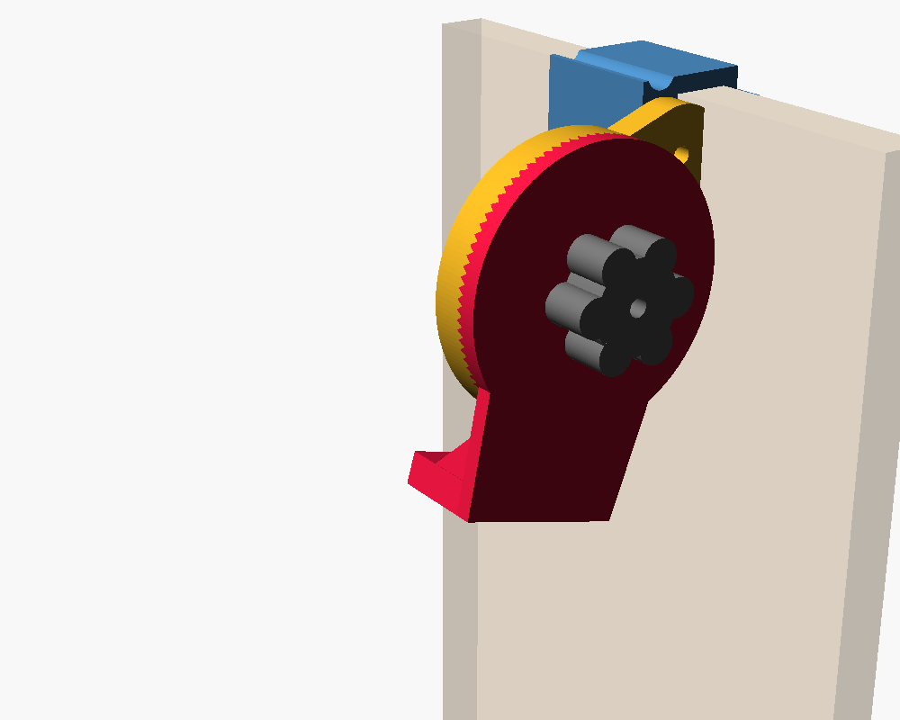
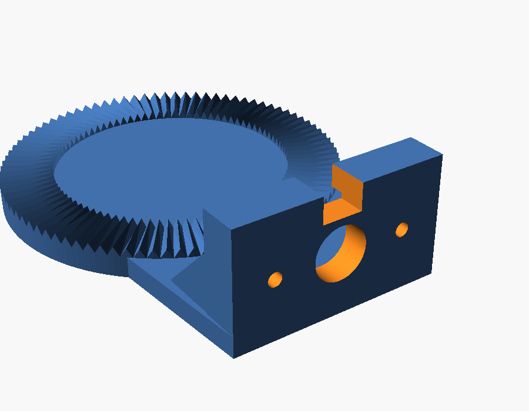
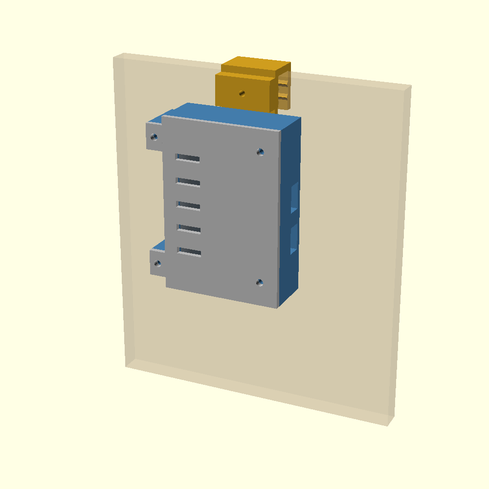
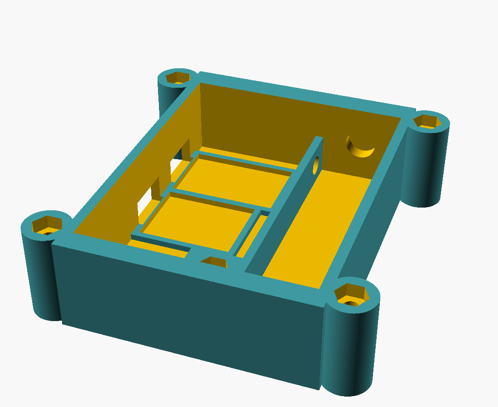
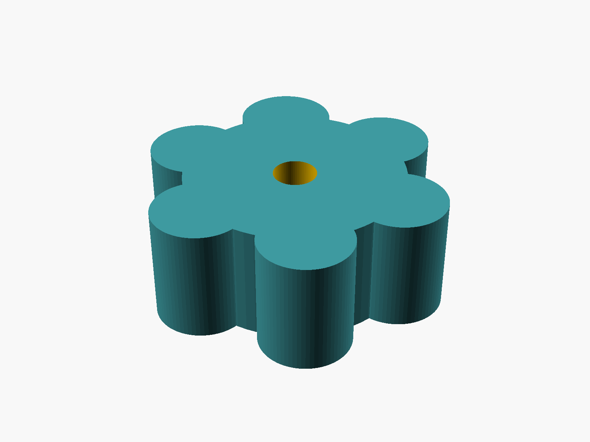
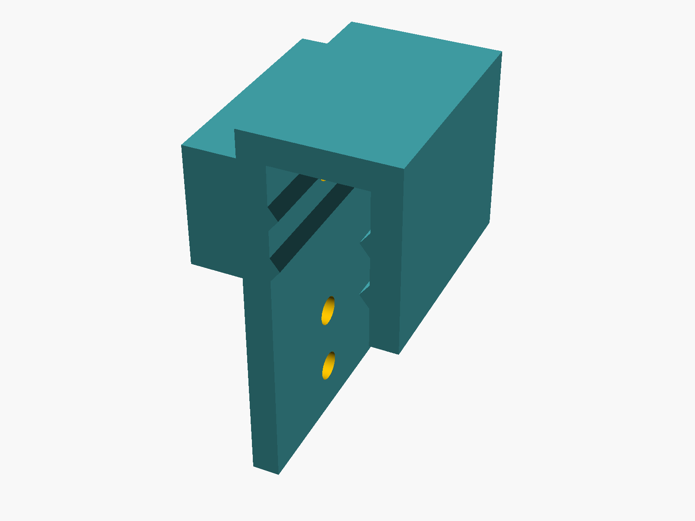

# Egg Basket Monitor

Sensor de nivel para una canasta de huevos de cocina. Se cuelga del borde,
mide la distancia al fondo con un sensor de tiempo de vuelo y reporta a
Grafana Cloud cada hora, con alertas a Telegram cuando quedan pocos huevos o
cuando el dispositivo deja de reportar.

El problema que resuelve no es "cuántos huevos hay" sino "avisar con
antelación antes de quedarse en cero", y hacerlo sin volcar la canasta,
sin PCB a medida y sin infraestructura corriendo en casa. El diseño completo,
con las alternativas descartadas y el porqué de cada decisión, está en
[`docs/superpowers/specs/2026-09-04-egg-basket-monitor-design.md`](docs/superpowers/specs/2026-09-04-egg-basket-monitor-design.md).

## Cómo funciona

Un ESP32-C3 despierta una vez por hora, enciende un **VL53L1X** (sensor ToF de
zona única) apuntado en diagonal hacia el fondo de la canasta, toma 20
lecturas y envía la mediana por HTTPS directo a Grafana Cloud (Influx line
protocol, sin MQTT ni broker intermedio). El resto del tiempo duerme.

El sensor no mide verticalmente desde arriba porque eso taparía la boca de la
canasta. En cambio, la cabeza cuelga de un lado corto y apunta en diagonal
hacia el opuesto. El emisor del VL53L1X dispara un cono fijo de 27° que no se
puede estrechar, así que con las medidas reales de la canasta (300 × 150 ×
500 mm) el ángulo de apuntado válido queda acotado a una ventana de apenas
8-20° desde la vertical — fuera de ese rango el cono golpea una pared antes de
llegar al fondo y el sensor mide la pared en vez de los huevos. Ese cálculo
vive en `cad/lib/geometry.scad` y aborta la compilación si la geometría de la
canasta no deja ningún ángulo válido.

La calibración distancia → nivel de llenado no vive en el firmware: se hace
con dos variables (`d_vacia`, `d_llena`) en la query del dashboard de Grafana,
para poder recalibrar sin reflashear.

## Hardware

- **ESP32-C3 SuperMini** — ya disponible, sin costo adicional.
- **VL53L1X** (módulo pequeño de 3.3 V, sin regulador AMS1117) — sensor de
  distancia por tiempo de vuelo, zona única.
- **Celda 18650** + **TP4056 con protección** (DW01A + FS8205A) para carga y
  corte por sobre/subdescarga.
- Divisor resistivo 1 MΩ/1 MΩ para leer la tensión de batería por ADC, porque
  el SuperMini no trae uno de fábrica.
- Todo se conecta con cable Dupont sobre módulos comerciales: no hay PCB
  custom.

**Presupuesto energético** con envíos cada hora y celda de 3000 mAh
(2400 mAh utilizables): ~16.6 mAh/día, lo que da **~4 meses entre cargas**
(hasta ~8.5 meses si se desuelda el LED de power del SuperMini, que por sí
solo es el ~90% del consumo en deep sleep). Detalle completo del presupuesto
y de los riesgos abiertos de energía (LDO del SuperMini, módulo VL53L1X con
regulador equivocado) en el spec de diseño.

## Piezas impresas

Siete piezas, ninguna necesita soportes, ~90 g de PETG en total (PETG y no
PLA porque la cocina tiene calor y grasa). Toda la tornillería es métrica
normal contra tuerca embutida — no hay un solo autorroscante en el proyecto.

**Cabeza del sensor** — mordaza al borde + placa + pod articulado por un
acoplamiento Hirth de detentes cada 4° + pomo de apriete. Cuelga hacia
*dentro* de la canasta.

| | |
|---|---|
|  |  |

**Caja de electrónica** — celda 18650 + TP4056 + ESP32-C3, con su propio
gancho al borde. Cuelga hacia *fuera*, y su peso contrarresta el brazo de la
cabeza del sensor en vez de desequilibrar la canasta.

| | |
|---|---|
|  |  |

Dos piezas sueltas, por si sirve de referencia rápida — el pomo de apriete
de la articulación y el gancho al borde que comparten la mordaza del sensor
y la caja:

| | |
|---|---|
|  |  |

### Generar los STL

```
python cad/build.py                 # las siete piezas
python cad/build.py pod knob        # solo estas
python cad/build.py --report        # solo el informe de geometría y tornillería, sin STL
```

Los STL salen a `cad/out/` (generado, fuera del repo). El script imprime
además las longitudes de tornillo calculadas a partir de las cotas actuales
de `cad/params.scad`, y devuelve código de salida distinto de cero si algún
`assert` de geometría falla — por ejemplo, si una canasta con otras medidas
no deja ningún ángulo de apuntado válido.

Todas las cotas (dimensiones de la canasta, FOV del sensor, tamaño de
tornillería, etc.) están centralizadas en `cad/params.scad`, con comentarios
que explican el porqué de cada una. La geometría del sensor y la caja vive en
`cad/sensor_head.scad` y `cad/electronics_box.scad`.

**Impresión:** PETG, capa 0.2 mm, 4 perímetros, sin soportes.

## Lista de materiales

Componentes a comprar (~USD 8-12, todo en AliExpress) y detalle completo de
la tornillería (longitudes calculadas por el propio CAD) en
[`docs/bom.md`](docs/bom.md).

## Firmware y dashboard

Este repo por ahora es solo el diseño mecánico (CAD) y el spec de diseño; no
hay todavía código de firmware ni el dashboard de Grafana en el árbol. El
plan de firmware (ciclo de despertar, formato de la línea Influx, modo de
calibración por serial) y el de Grafana (dashboard con variables de
calibración, dos reglas de alerta a Telegram) están descritos en el spec de
diseño enlazado arriba.
