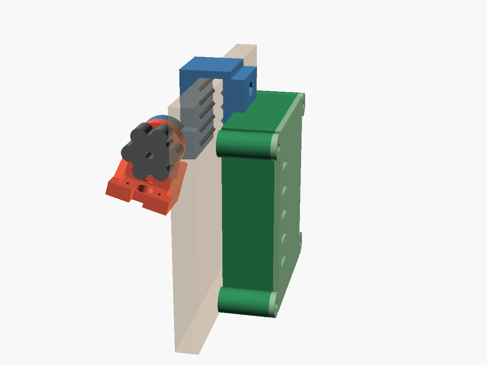
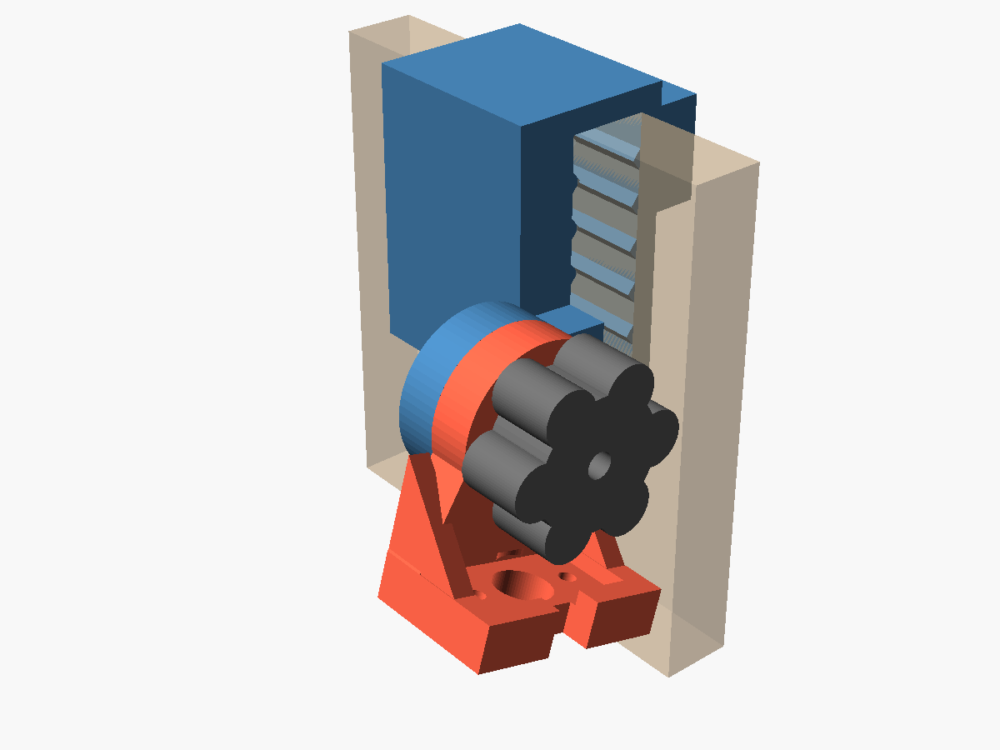
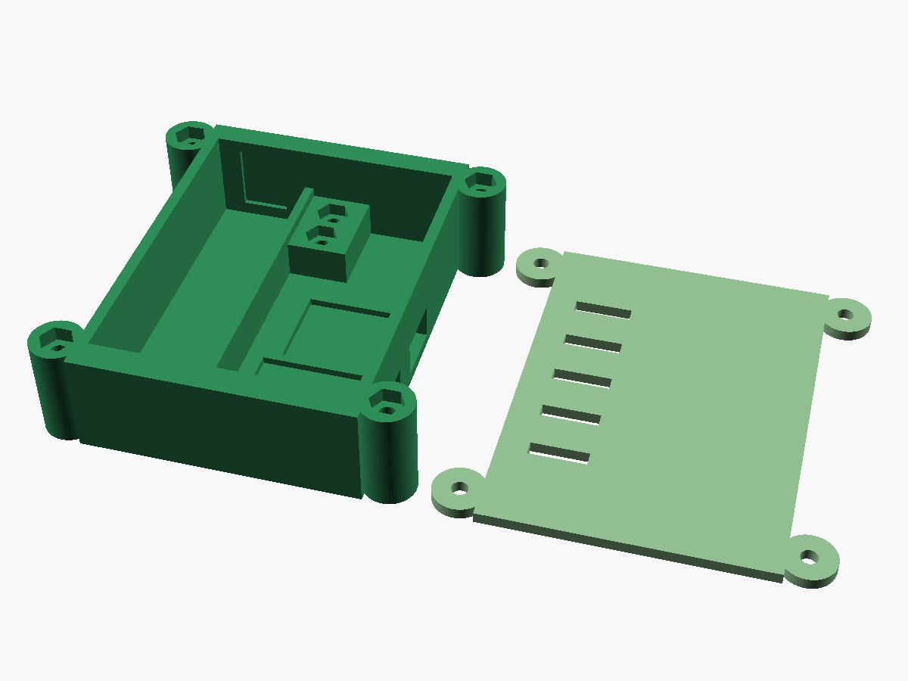
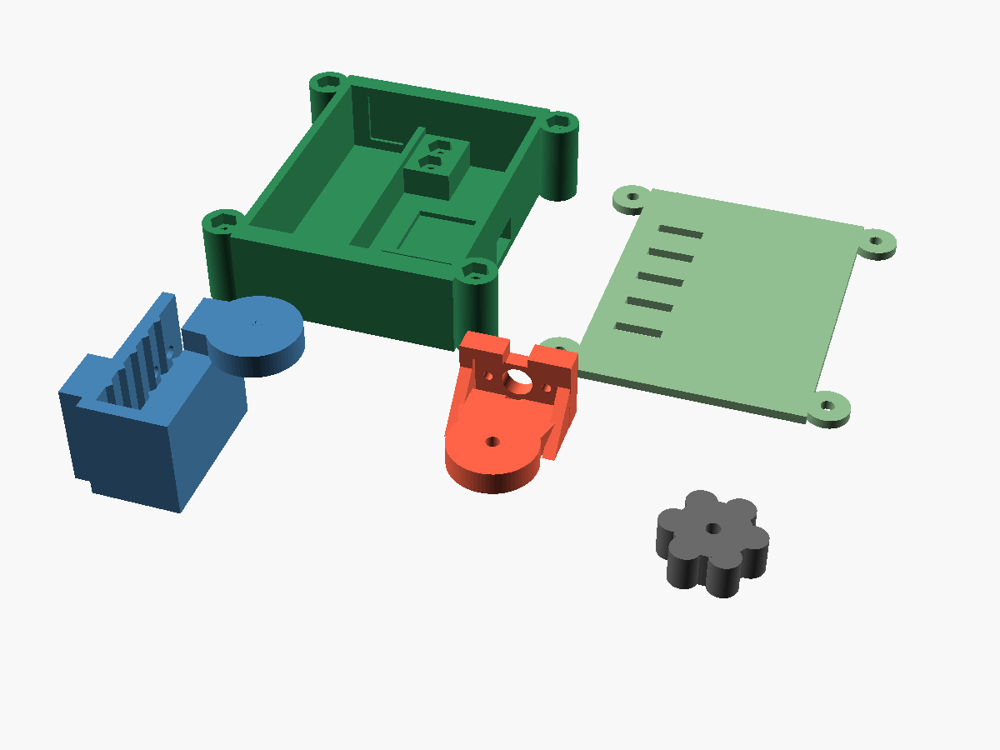

# Egg Basket Monitor

Sensor de nivel para una canasta de huevos de cocina. Se cuelga del borde,
mide la distancia hasta los huevos con un sensor de tiempo de vuelo
(**VL53L0X**, módulo TOF200C), duerme casi todo el tiempo en un **ESP32-C3
SuperMini** a batería y manda una lectura por hora a **Grafana Cloud**.

El objetivo no es contar huevos, sino avisar con tiempo antes de quedarse en
cero, y hacerlo:

- **sin volcar ni modificar la canasta** — todo cuelga del borde con piezas
  impresas;
- **sin PCB a medida** — módulos comerciales y cables Dupont;
- **sin infraestructura en casa** — el dispositivo habla directo con Grafana
  Cloud, sin broker MQTT ni servidor intermedio;
- **sin credenciales en el código** — WiFi y token se cargan desde un portal
  web que sirve el propio dispositivo.

## Cómo funciona

```
 ┌──────────── deep sleep (60 min por defecto) ◄──────────────┐
 ▼                                                            │
despierta → 20 lecturas ToF → mediana + desviación → batería → WiFi → POST HTTPS
            (sensor encendido     (descarta las        (GPIO3)         a Grafana Cloud
             sólo ~1 s)            inválidas)                          (Influx line protocol)
```

El sensor cuelga de un lado corto de la canasta y apunta **en diagonal** hacia
el fondo, para no tapar la boca. El ángulo se ajusta a mano con una bisagra de
fricción, usando el [modo calibración](docs/calibration.md) para verlo en
vivo. Cuantos más huevos hay, más corta es la distancia medida.

Cada envío es una línea de
[Influx line protocol](https://docs.influxdata.com/influxdb/v2/reference/syntax/line-protocol/):

```
eggbasket,device=cocina distance_mm=412,stddev=1.8,valid=19,status=0,battery_mv=4050,rssi=-52,boots=412
```

| Campo | Qué es |
|---|---|
| `distance_mm` | Mediana de las lecturas válidas del ciclo |
| `stddev` | Desviación estándar de esas lecturas. Si sube de forma sostenida, el ángulo se corrió |
| `valid` | Cuántas de las 20 lecturas fueron válidas |
| `status` | `0` = lectura del ciclo · `1` = lectura reenviada desde el buffer de reintento · `2` = el sensor falló (esa línea no lleva `distance_mm` ni `stddev`) |
| `battery_mv` | Tensión de la celda, leída por el divisor en GPIO3 |
| `rssi` | Señal WiFi en dBm |
| `boots` | Contador de despertares desde el último reset |

Si el envío falla (sin WiFi, error de conexión o del servidor), la muestra
se guarda en la memoria RTC, que sobrevive al deep sleep, con la hora real en
que se midió. En el siguiente envío que funcione se mandan **todas** las
pendientes junto con la actual, en un solo POST y cada una con su hora: un
router reiniciándose no deja huecos en los datos. Entran 48 muestras (dos
días enviando cada hora); si se llena, se descarta la más vieja. Si Grafana
rechaza los datos en sí (HTTP 400, por ejemplo una muestra demasiado vieja),
se descartan en vez de reintentarlos para siempre. El log por serial muestra
las líneas exactas de cada envío. La
calibración distancia → nivel de llenado no vive en el firmware sino en
Grafana, para poder recalibrar sin reflashear.

## Hardware

| Componente | Para qué | Nota |
|---|---|---|
| ESP32-C3 SuperMini | Microcontrolador, WiFi | Número serigrafiado = número de GPIO |
| Módulo ToF **TOF200C (VL53L0X)** | Mide la distancia | **VIN a 3V3, no a 5V.** Ver [abajo](#el-sensor-vl53l0x-no-vl53l1x) |
| TP4056 **con protección** (DW01A + FS8205A), USB-C | Carga la celda y la corta por sobre/subdescarga | La versión sin protección no sirve con una celda desnuda |
| Celda 18650 | Batería, ~4 meses por carga | Nada se suelda a la celda |
| 2 resistencias iguales (1 MΩ) | Divisor para leer la batería | Cualquier par igual sirve |
| Tornillería M3 + M2 con tuercas | Montaje | Sin un solo autorroscante |

Todo por ~USD 8-12 si ya tenés la placa y la celda. Lista completa, con
búsquedas de AliExpress y largos de tornillo, en [`docs/bom.md`](docs/bom.md).

### Conexionado


| Señal | ESP32-C3 SuperMini | TOF200C |
|---|---|---|
| SDA (I2C) | GPIO4 | SDA |
| SCL (I2C) | GPIO5 | SCL |
| XSHUT (apagado del sensor) | GPIO6 | SHUT |
| Alimentación | 3V3 / GND | VIN / GND |
| Lectura de batería | GPIO3 ← punto medio del divisor | — |

El I2C va en GPIO4/5 y no en los pines por defecto del C3 porque GPIO8 es el
LED RGB de la placa y GPIO9 el botón BOOT.


Tabla de pines completa, detalles del divisor y el riesgo abierto del
regulador de la placa en [`docs/wiring.md`](docs/wiring.md).

### El sensor: VL53L0X, no VL53L1X

El diseño original pedía un VL53L1X, pero el módulo instalado es un
**TOF200C**, que lleva un **VL53L0X**. Los dos se parecen mucho y contestan
en la misma dirección I2C (`0x29`), así que un escaneo del bus no los
distingue, pero sus registros son incompatibles: el VL53L0X usa direcciones
de 8 bits y el VL53L1X de 16. Con la librería equivocada el escaneo encuentra
el sensor y aun así la inicialización falla siempre. El firmware usa
`pololu/VL53L0X`.

| | VL53L0X (TOF200C, instalado) | VL53L1X (TOF400C) |
|---|---|---|
| Alcance en interior | ~1.2 m (hasta ~2 m con poca luz) | hasta 4 m |
| Cono de visión | 25°, fijo | 27°, reducible con ROI hasta ~15° |
| Identificación | registro `0xC0` = `0xEE` | registro `0x010F` = `0xEACC` |
| Librería | `pololu/VL53L0X` | `pololu/VL53L1X` |

Para una canasta de 50 cm el alcance sobra. La limitación es el cono: sin ROI
no se puede estrechar, y si toca las paredes de la canasta las lecturas salen
más cortas que la distancia real a los huevos. Si pasa, la salida es un
TOF400C, que se conecta igual.

## Piezas impresas

Cinco piezas en PETG (no PLA: la cocina tiene calor y grasa), ninguna
necesita soportes. Toda la tornillería es métrica contra tuerca embutida.



*Conjunto colgado del borde (vista aproximada): la cabeza del sensor hacia
dentro de la canasta y la caja de electrónica por fuera, sujetas por el mismo
`mount`; el peso de la caja compensa el brazo del sensor.*

| | |
|---|---|
|  |  |
| **Cabeza del sensor**: `mount` al borde (azul) + `pod` con el bolsillo del TOF200C (rojo) + `knob` de la bisagra de fricción (gris) | **Caja de electrónica**: hueco de la 18650, marcos del TP4056 y el ESP32-C3, espina con las tuercas para el `mount` y la `lid` al lado |



| Pieza | Qué es | Orientación de impresión |
|---|---|---|
| `mount` | Gancho al borde con un solo punto de apriete, sostiene el pod | De canto |
| `pod` | Alojamiento del TOF200C con la oreja de la bisagra | Oreja hacia arriba |
| `knob` | Pomo de apriete de la bisagra de fricción | Plana |
| `box` | Caja de la electrónica | Boca hacia arriba |
| `lid` | Tapa de la caja | Plana |

Los STL se generan con OpenSCAD:

```
python cad/build.py                 # las cinco piezas, a cad/out/
python cad/build.py pod knob        # sólo esas
python cad/build.py --report        # informe de geometría y tornillería, sin STL
```

Todas las cotas (medidas de la canasta, cono del sensor, tornillería) están
en [`cad/params.scad`](cad/params.scad). `cad/lib/geometry.scad` calcula el
rango de ángulos en el que el cono del sensor llega al fondo sin tocar las
paredes, y aborta la compilación si la canasta no deja ninguno.

**Impresión:** PETG, capa 0.2 mm, 4 perímetros, sin soportes.

## Puesta en marcha

1. **Imprimir y montar** las piezas (arriba) y cablear según el
   [esquema](docs/wiring.md).
2. **Flashear** con [PlatformIO](https://platformio.org/):
   ```
   cd firmware
   pio run -t upload
   pio device monitor      # opcional, para ver los logs
   ```
3. **Configurar.** Recién flasheado, el dispositivo levanta la red WiFi
   **`EggBasket-Setup`** (contraseña `eggbasket2026`, cambiala en
   `firmware/include/config.h` antes de flashear). Conectate desde el celular
   y cargá tu WiFi, la URL de escritura Influx de Grafana Cloud, el Instance
   ID, el token, el nombre del dispositivo y el intervalo de sueño.
4. **Calibrar el ángulo** con la canasta vacía, usando el
   [modo calibración](docs/calibration.md).
5. **Verificar** en Grafana Cloud → Explore → `eggbasket_distance_mm`.

Paso a paso completo, con capturas de lo que sale por serial y qué hacer si
algo falla, en [`docs/setup-tutorial.md`](docs/setup-tutorial.md).

### Botón BOOT y LED

El único botón es el BOOT de la placa. Sostenido **al arrancar** (reset o
conexión de la batería) decide el modo:

| BOOT al arrancar | Modo | LED |
|---|---|---|
| Sin tocar | Ciclo normal: mide, envía, duerme | Verde corto = envío OK · rojo corto = falló, queda para reintentar |
| 3-8 s | Calibración: 60 s de distancia cruda por serial a 2 Hz | Dos parpadeos verdes |
| Más de 8 s | Portal de configuración `EggBasket-Setup` | Tres parpadeos azules y queda azul fijo |

Tres parpadeos rojos significan batería por debajo de 3.3 V: el dispositivo
entra en sueño indefinido para proteger la celda hasta que se la cargue.

## Autonomía

Con una 18650 de 3000 mAh (2400 mAh utilizables) y un envío por hora:

| Concepto | mAh/día |
|---|---|
| Deep sleep del C3 SuperMini de fábrica (~500 µA) | 12.0 |
| 24 despertares × ~6 s @ ~80 mA | 3.2 |
| TP4056 en reposo + divisor de batería | 1.3 |
| Sensor con XSHUT bajo | ~0.1 * |
| **Total** | **~16.6** |

Unos **4 meses entre cargas**, contando la autodescarga de la celda. El ~90%
del consumo dormido es el LED rojo de power del SuperMini: raspándolo o
desoldándolo, la autonomía sube a **~8.5 meses**. Bajar a dos envíos por día
apenas suma un mes, porque el sueño domina.

\* Calculado para el VL53L1X. El TOF200C trae su propio regulador, cuyo
consumo en reposo no está medido todavía: si resulta alto, ver el plan B
(load switch) en [`docs/bom.md`](docs/bom.md).

## Grafana Cloud

Los datos entran por el endpoint Influx de Grafana Cloud y quedan como series
Prometheus (`eggbasket_distance_mm`, `eggbasket_battery_mv`, …) con el label
`device`. Lo planificado, todavía **pendiente** en el repo:

- **Dashboard** con variables `d_vacia` y `d_llena` para convertir distancia
  en nivel de llenado, más paneles de batería, `stddev`/`valid` y RSSI.
- **Dos alertas a Telegram:** nivel por debajo del 25% durante 2 h
  ("quedan pocos huevos"), y **sin datos durante 36 h** ("el sensor no
  reporta"). La segunda importa tanto como la primera: sin ella, una batería
  agotada es indistinguible de una canasta llena.

El detalle está en la sección "Grafana Cloud" del
[spec de diseño](docs/superpowers/specs/2026-09-04-egg-basket-monitor-design.md).

## Estado del proyecto

- **Firmware:** compila con PlatformIO para el ESP32-C3. El sensor TOF200C
  está verificado en banco, midiendo con el driver del VL53L0X. Falta
  probar el ciclo completo (sensor + WiFi + Grafana) en la placa.
- **CAD:** rediseñado para el TOF200C, con rim mount y bisagra de fricción.
- **Grafana:** dashboard y alertas pendientes.
- **Riesgos abiertos:**
  - El regulador del SuperMini: si es un AMS1117 en vez de uno de baja
    caída, la placa se apaga por debajo de ~4.4 V, con la celda casi llena.
    Se verifica con una fuente variable; ver [`docs/wiring.md`](docs/wiring.md).
  - El cono fijo del VL53L0X contra las paredes de la canasta (ver
    [el sensor](#el-sensor-vl53l0x-no-vl53l1x)).

## Estructura del repo

```
firmware/       Proyecto PlatformIO (ESP32-C3 SuperMini, framework Arduino)
  include/        config.h: pines, tiempos y valores por defecto
  src/            main.cpp (ciclo), sensor, power, telemetry, portal, settings, boot_mode
cad/            Piezas paramétricas en OpenSCAD + build.py para exportar STL
  lib/            Geometría del cono del sensor y gancho al borde
docs/           Cableado, tutorial, calibración, lista de materiales, imágenes
  superpowers/    Specs de diseño y planes de implementación
```

## Documentación

| Documento | Contenido |
|---|---|
| [`docs/setup-tutorial.md`](docs/setup-tutorial.md) | Flasheo, portal de configuración, verificación y problemas comunes |
| [`docs/wiring.md`](docs/wiring.md) | Pinout completo, cadena de alimentación, sensor, botón BOOT |
| [`docs/calibration.md`](docs/calibration.md) | Cómo elegir el ángulo del sensor con el modo calibración |
| [`docs/bom.md`](docs/bom.md) | Lista de materiales, tornillería y piezas impresas |
| [Spec de diseño](docs/superpowers/specs/2026-09-04-egg-basket-monitor-design.md) | Por qué cada decisión, alternativas descartadas, presupuesto energético |
| [Spec del portal WiFi](docs/superpowers/specs/2026-09-17-firmware-wifi-config-design.md) | Provisioning por portal cautivo y guardado en NVS |
| [Spec del rim mount](docs/superpowers/specs/2026-09-18-cad-rim-mount-redesign-design.md) | Rediseño del montaje al borde y bisagra de fricción |

## Licencia

[MIT](LICENSE).
