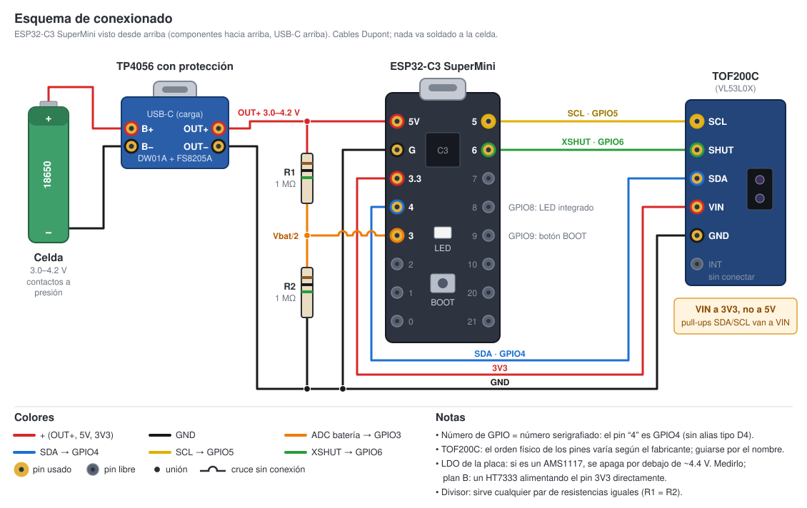
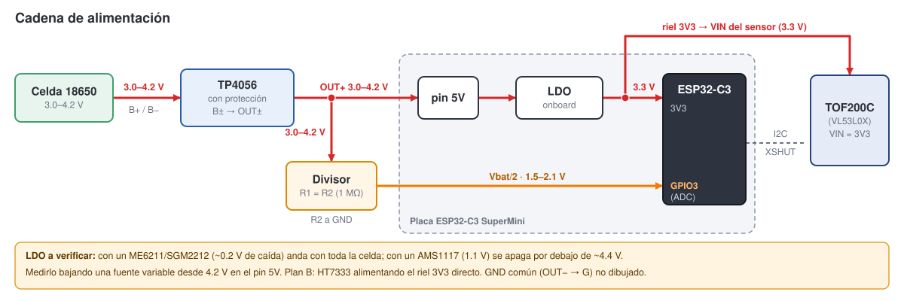

# Cableado y pinout

Componentes: **ESP32-C3 SuperMini**, sensor ToF **VL53L0X** (módulo
**TOF200C**; ver "Módulo del sensor" más abajo), cargador **TP4056 con protección**, celda **18650**, divisor
resistivo de dos resistencias iguales (1 MΩ/1 MΩ nominal, pero sirve
cualquier par igual — ver la sección "Cadena de alimentación" más abajo).
Nada se suelda a la celda; ver `docs/bom.md` para el resto de materiales y
`cad/` para las piezas que sostienen todo esto físicamente.

## Diagramas





El esquema dibuja el SuperMini con sus 16 pines en la posición real (vista
desde arriba, USB-C arriba): los usados en dorado, los libres en gris. El
orden físico de los pines del TOF200C cambia según el fabricante, así que
guiate por el nombre serigrafiado. Ambos son SVG locales (sin dependencias
externas); se pueden abrir directamente en el navegador o en cualquier
editor de imágenes vectoriales para imprimir o anotar.

## ¿El número de pin es el que trae grabado la placa o un nombre de código?

**Es el mismo número.** En el ESP32-C3 SuperMini, el número serigrafiado
junto a cada pin *es* el número de GPIO: el pin marcado `4` en la placa es
`GPIO4`, sin ninguna traducción intermedia (a diferencia de placas estilo
NodeMCU/ESP8266, donde el pin marcado `D4` en realidad es `GPIO2`). Por eso
en el firmware (`firmware/include/config.h`) cada pin está definido dos
veces: una constante con el número tal como aparece en la placa
(`GPIO4_SDA`, `GPIO9_BOOT`, etc.) y un alias con el nombre funcional que usa
el resto del código (`PIN_I2C_SDA`, `PIN_BOOT_BUTTON`, etc.):

```cpp
constexpr int GPIO4_SDA = 4;          // marcado "4" en la placa
constexpr int PIN_I2C_SDA = GPIO4_SDA; // nombre que usa el resto del firmware
```

## Tabla de pines (ESP32-C3 SuperMini)

| Señal | GPIO (= número en la placa) | Va a | Por qué este pin |
|---|---|---|---|
| SDA (bus I2C) | GPIO4 | TOF200C SDA | Se evita el I2C por defecto del C3: GPIO8 es el LED RGB integrado y GPIO9 es el botón BOOT |
| SCL (bus I2C) | GPIO5 | TOF200C SCL | Ídem |
| XSHUT | GPIO6 | TOF200C SHUT | Bajo = apagado; el firmware lo lleva a GND entre lecturas y lo suelta (pull-up del módulo) para medir |
| ADC batería | GPIO3 | Nodo medio del divisor (dos resistencias iguales) | Único ADC libre tras reservar 4/5/6 |
| Botón BOOT / config | GPIO9 | Botón BOOT de la placa | Reutilizado: sostenerlo al arrancar decide el modo (ver `docs/setup-tutorial.md`) |
| LED de estado | GPIO8 | LED RGB integrado de la placa | Uso nativo del pin; solo importa como strapping *durante* el reset, no después |
| 3V3 / GND | — | TOF200C VIN / GND | Rieles de alimentación de la placa, sin número de GPIO |

**El bus I2C (SDA + SCL) es lo que conecta el sensor con el ESP32**, y es
bidireccional: SDA lleva datos en ambos sentidos, SCL es el reloj que genera
siempre el ESP32-C3 como maestro del bus. En el esquema, SDA va en azul y
SCL en amarillo, y XSHUT en verde para que no se confunda con el bus (XSHUT
sí es unidireccional, ESP32 → sensor).

## Cadena de alimentación

```
18650 (B+/B-) → TP4056 con protección (OUT+/OUT-)
             → pin 5V del ESP32-C3 SuperMini → LDO onboard → riel 3V3
                                              → divisor (R1=R2) → GPIO3
```

**El divisor no tiene que ser 1 MΩ/1 MΩ exactos.** Lo único que importa es
que las dos resistencias sean iguales entre sí: el punto medio siempre cae a
la mitad del voltaje de la batería sin importar la magnitud
(`V_medio = V_bateria × R2/(R1+R2)`, que da `V_bateria/2` cuando `R1=R2`).
Con un par de 100 kΩ (código de colores café-negro-amarillo) el divisor
consume ~21 µA en vez de ~2.1 µA — sigue siendo despreciable frente a los
~500 µA del deep sleep de la placa (ver `docs/bom.md`). El firmware no
cambia: `BATTERY_DIVIDER_RATIO` en `firmware/include/config.h` es `2.0f`
porque depende de que R1=R2, no de su valor absoluto.

**Riesgo abierto, a verificar con hardware en mano:** alimentar el pin 5V
directo con 3.7-4.2 V (el rango de una celda de litio) solo funciona bien si
la placa lleva un LDO de baja caída (p. ej. ME6211 o SGM2212, ~200 mV de
dropout). Si en cambio lleva un AMS1117 (1.1 V de dropout), el sistema se
apaga por debajo de ~4.4 V — es decir, con la celda todavía casi llena.

Cómo verificarlo: alimentar la placa desde una fuente de laboratorio variable
por el pin 5V, bajar la tensión lentamente desde 4.2 V y anotar en qué
voltaje el ESP32 hace brownout. Si el corte ocurre por encima de ~4.0 V, es
un AMS1117 y hay que cambiar de estrategia: alimentar el riel **3V3
directamente** desde un módulo HT7333 (quiescent ~4 µA) y no conectar USB y
batería al mismo tiempo mientras se usa esa ruta.

## Módulo del sensor: TOF200C (VL53L0X)

El módulo instalado es un **TOF200C**, que lleva un **VL53L0X**, no el
VL53L1X del diseño original. Los dos contestan en la dirección I2C `0x29` y
se parecen mucho, pero sus registros son incompatibles (8 bits en el
VL53L0X, 16 bits en el VL53L1X): con la librería del VL53L1X el escaneo I2C
encuentra el sensor pero `init()` falla siempre. El firmware usa la librería
`pololu/VL53L0X`. Para distinguirlos: registro `0xC0` = `0xEE` en el
VL53L0X; registro de 16 bits `0x010F` = `0xEACC` en el VL53L1X.

- **VIN a 3V3, no a 5V.** El TOF200C trae regulador y acepta 5V, pero sus
  pull-ups de SDA/SCL van a VIN y pondrían 5V en los GPIO del ESP32-C3.
- **Sin ROI.** El VL53L0X tiene el cono de 25° fijo; el VL53L1X permite
  estrecharlo. Si el cono toca las paredes de la canasta y las lecturas
  salen cortas, la salida es un módulo VL53L1X (se vende como **TOF400C**),
  que se conecta igual pero necesita volver a la librería `pololu/VL53L1X`.
- **Film protector.** Si mide siempre unos 20 mm, queda film en la ventana.

### Si se cambia a un módulo VL53L1X: qué versión pedir

Explícitamente la versión **pequeña de 3.3 V**. Si el módulo trae un
regulador AMS1117 igual que el punto anterior, su corriente de reposo
(~5 mA) es 50 veces el resto del circuito combinado en deep sleep, y la
batería dura semanas en vez de meses. Plan B si llega el módulo equivocado:
un load switch con MOSFET-P (~USD 1) que le corte la alimentación completa
durante el sueño, comandado desde el mismo pin que hoy maneja XSHUT.

## Botón BOOT: un solo botón, tres funciones

GPIO9 ya es el botón BOOT físico de la placa. El firmware lo reutiliza según
cuánto tiempo se sostenga presionado **en el instante del arranque**
(power-on, reset, o wake por temporizador):

| Sostenido | Modo |
|---|---|
| No presionado | Ciclo normal: mide, envía, duerme |
| 3-8 s | Calibración: 60 s de distancia cruda por serial a 2 Hz |
| Más de 8 s | Portal de configuración WiFi/Grafana (`EggBasket-Setup`) |

El LED da feedback de en qué modo se entró — ver `docs/setup-tutorial.md`
para la tabla completa de patrones. Si no hay ninguna configuración WiFi
guardada (equipo recién flasheado), entra directo al portal sin necesidad de
sostener el botón.

## Notas de la corona ToF / cono del sensor

El VL53L0X del TOF200C tiene un cono fijo de 25° y no admite ROI. (Con un
VL53L1X el cono es de 27° y el receptor admite ROI reducido hasta 15° con
4×4 SPADs.) El ángulo físico de montaje se ajusta con la bisagra de
fricción del `pod` (`cad/sensor_head.scad` + `cad/rim_mount.scad`), no por
software. Los detalles de por qué el rango útil es el que calcula
`lib/geometry.scad` están en
`docs/superpowers/specs/2026-09-04-egg-basket-monitor-design.md` y en
`docs/superpowers/specs/2026-09-18-cad-rim-mount-redesign-design.md`.
