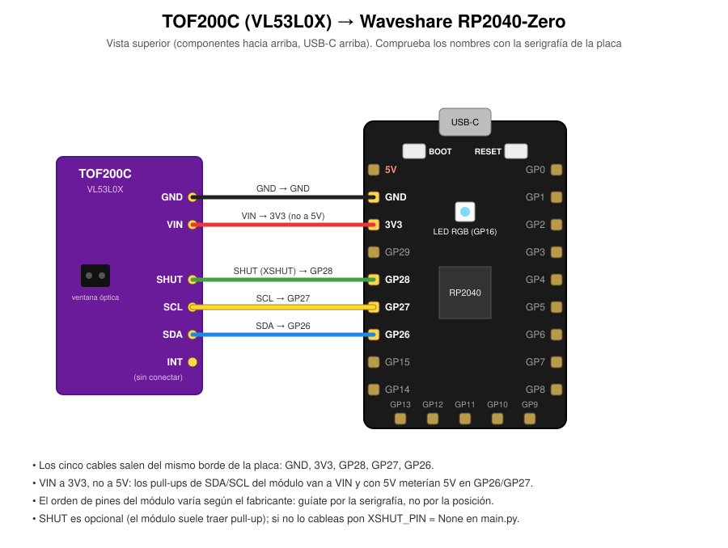

# Prueba del sensor ToF con Waveshare RP2040-Zero

Banco de pruebas mínimo para confirmar que el sensor de distancia funciona,
aislado del ESP32-C3 y del resto del proyecto. Usa una Waveshare RP2040-Zero
con MicroPython porque no hace falta compilar nada: se copian los `.py` y se
ve el resultado al instante por el serial y por el LED RGB de la placa.

Detecta solo cuál de los dos chips hay conectado y usa su driver:
**VL53L0X** (el del módulo TOF200C que hay ahora) o **VL53L1X** (el que pide
el diseño).

No forma parte del firmware del monitor. Si el sensor pasa esta prueba, el
problema que quede está en el lado del ESP32; si no la pasa, el script dice
en qué paso falla.

| Archivo | Qué es |
|---|---|
| `INSTRUCCIONES.md` | **Empieza aquí:** extensiones de VS Code, modo bootloader, cómo subir la prueba y leer los logs |
| `main.py` | La prueba. MicroPython lo ejecuta solo al arrancar la placa |
| `vl53l0x.py` | Driver del VL53L0X, portado de la librería de Pololu |
| `vl53l1x.py` | Driver mínimo del VL53L1X, portado de la ULD API oficial de ST |
| `log.py` | Logs con marca de tiempo al serial y a `log.txt` en la placa |
| `wiring.svg` | Diagrama de conexiones |

## El módulo es un VL53L0X, no un VL53L1X

El módulo que hay es un **TOF200C**, que lleva un **VL53L0X**. El diseño
original pedía un **VL53L1X**; el módulo equivalente de la
misma familia genérica se vende como **TOF400C**. Los dos chips se parecen
mucho y contestan en la misma dirección I2C (`0x29`), así que un escaneo no
los distingue, pero sus registros son incompatibles: el VL53L0X usa
direcciones de registro de 8 bits y el VL53L1X de 16. Un firmware escrito
para el VL53L1X recibe respuesta en `0x29` y luego falla al leer el estado
de arranque, que es justo lo que pasaba en esta prueba antes de añadir el
driver del VL53L0X, y lo que pasaba con el firmware del ESP32 hasta que pasó
a usar la librería `pololu/VL53L0X`.

Para esta prueba da igual: `main.py` lee el Model ID de las dos formas
(`0xC0` = `0xEE` → VL53L0X; `0x010F` = `0xEACC` → VL53L1X) y usa el driver
que toca. Para el monitor de la canasta sí importa:

| | VL53L0X (TOF200C) | VL53L1X (TOF400C) |
|---|---|---|
| Alcance en interior | ~1.2 m por defecto, hasta ~2 m en modo largo con poca luz | hasta 4 m (modo largo), ~1.3 m en modo corto |
| Cono de visión | 25° fijo | 27°, reducible con ROI hasta ~15° |
| ROI (apuntar una zona) | No | Sí |
| Inmunidad a luz ambiente | Menor | Mejor en modo corto |

Con 500 mm de profundidad el alcance del VL53L0X sobra, pero el diseño
depende de estrechar el cono para no medir las paredes de la canasta
(`cad/lib/geometry.scad` calcula la ventana de ángulos con 27°), y el
VL53L0X no tiene ROI. Sirve para validar el cableado y el montaje; para el
monitor final conviene el VL53L1X.

## Antes de conectar la placa nueva

La Raspberry Pi Pico con la que empezó esta prueba se quemó. Antes de
arriesgar la RP2040-Zero:

1. **Mide el módulo del sensor con el multímetro en continuidad** entre VIN y
   GND. Si pita, el sensor está en corto y pudo ser lo que quemó la Pico: no lo
   conectes.
2. **Conecta la RP2040-Zero sola por USB**, sin nada cableado, y sube la
   prueba. Tiene que verse rojo-verde-azul en el LED y luego 2 destellos
   rojos repitiéndose (el bus está vacío, es lo correcto sin sensor). Así
   sabes que la placa está bien antes de meter el sensor en la ecuación.
3. **Desconecta el USB para cablear** y repasa cada cable con el diagrama
   antes de volver a enchufar. El pin 5V está justo al lado de GND.
4. **VIN del sensor a 3V3, no a 5V.** El TOF200C trae regulador y aguanta
   5V, pero sus pull-ups de SDA/SCL van a VIN: alimentado a 5V pondría 5V en
   los pines del RP2040, que sólo toleran 3.3V.

## Conexiones



| TOF200C (VL53L0X) | RP2040-Zero | Borde izquierdo (USB-C arriba) |
|---|---|---|
| GND | GND | 2.º pin |
| VIN | 3V3 | 3.º pin |
| SHUT (XSHUT) | GP28 | 5.º pin |
| SCL | GP27 | 6.º pin |
| SDA | GP26 | 7.º pin |
| INT (GPIO1) | — sin conectar | — |

Un módulo VL53L1X se conecta igual; sus pines se suelen llamar XSHUT y
GPIO1.

Los cinco cables salen del mismo borde de la placa. GP26/GP27 son el bloque
I2C1 del RP2040.

- **VIN a 3V3, no a 5V** (ver el punto 4 de arriba). Además, el módulo
  VL53L1X pequeño que pide la lista de materiales no trae regulador.
- La RP2040-Zero lleva los nombres serigrafiados junto a cada pin: compruébalos
  con la tabla antes de soldar o conectar.
- El orden de los pines del módulo cambia según el fabricante. Conecta por el
  nombre serigrafiado, no por la posición.
- SHUT/XSHUT es opcional: el módulo lo trae con pull-up. Si no lo cableas,
  pon `XSHUT_PIN = None` en `main.py`. El script no lo fuerza a 3.3 V: lo
  lleva a GND para reiniciar el sensor y luego lo suelta (drenador abierto).

## Instalar, ejecutar y ver los logs

El paso a paso completo (extensión MicroPico para VS Code, modo bootloader
con los botones BOOT y RESET, subir los archivos, leer los logs y qué
significa cada error I2C) está en [`INSTRUCCIONES.md`](INSTRUCCIONES.md). En
corto, con `mpremote` desde PowerShell de Windows:

```
mpremote cp main.py vl53l0x.py vl53l1x.py log.py :
mpremote reset
mpremote repl
```

El log registra cada paso del arranque, cada distancia medida y cada error
I2C con su causa probable:

```
[     1.220] INFO  SDA (GP26): pull-up externo presente, línea en alto. OK
[     1.221] INFO  SCL (GP27): pull-up externo presente, línea en alto. OK
[     1.230] INFO  Escaneo I2C1 a 100 kHz: ['0x29']
[     1.236] INFO  Chip detectado: VL53L0X (registro 0xC0 = 0xEE)
[     1.260] INFO  Prueba de estabilidad del bus: 50/50 lecturas correctas, 0 errores I2C, 0 valores corruptos
[     1.410] INFO  Sensor inicializado en 148 ms. Midiendo; ...
[     1.520] DEBUG distancia   412 mm   señal   9344 kcps
...
[     3.420] INFO  Resumen: 20 válidas de 20, mediana 411 mm, desviación 1.8 mm | sesión: ...
```

Ante un fallo no se detiene: registra el error y reintenta desde el principio
cada pocos segundos, así que se puede mover un cable mientras se mira el log y
ver cuándo falla y cuándo se recupera.

## Leer el LED sin PC

La RP2040-Zero no tiene un LED simple sino uno RGB (WS2812 en GP16). Con la
placa alimentada por cualquier cargador USB, dice cómo va la prueba:

| LED | Significado |
|---|---|
| Rojo, verde, azul al encender | El script arrancó (y comprueba el LED) |
| 2 destellos rojos, pausa, repite | Nada responde en `0x29`: cableado o alimentación |
| 3 destellos rojos, pausa, repite | Hay algo en `0x29`, pero no es VL53L0X ni VL53L1X |
| 4 destellos rojos, pausa, repite | Se identificó el sensor pero no arranca o dejó de medir |
| Destello verde por lectura | Midiendo bien |
| Azul fijo | Hay algo a menos de 150 mm: acerca la mano para probar |
| Destello amarillo por lectura | Lectura inválida (nada en rango) |

Los códigos de error se repiten entre reintentos: en cuanto el fallo se
corrige, la prueba vuelve sola a medir.

Algunas tandas de la RP2040-Zero traen el LED con el rojo y el verde
intercambiados. Si al encender el primer color es verde en vez de rojo, pon
`LED_SWAP_RED_GREEN = True` en `main.py`.

## Si falla

La tabla completa de mensajes del log está en
[`INSTRUCCIONES.md`](INSTRUCCIONES.md#qué-mirar-si-falla-la-conexión-i2c).

**2 destellos rojos: el bus I2C está vacío.** Casi siempre es cableado:
- SDA y SCL cruzados: es el error más común.
- VIN sin alimentar: mide 3.3 V entre VIN y GND del módulo con el multímetro.
- XSHUT a GND o flotando en un módulo sin pull-up: el sensor queda apagado.
- Dupont flojo o con el crimpado roto: prueba cada cable con continuidad.

Si el escaneo encuentra otras direcciones pero no `0x29`, hay otro dispositivo
en el bus o el sensor tiene la dirección cambiada.

**3 destellos rojos: no es ni VL53L0X ni VL53L1X.** El log muestra lo que
se leyó en `0xC0` y `0x010F`. Puede ser otro chip en `0x29` (un VL6180X, por
ejemplo, el del TOF050C) o lecturas corruptas por mal contacto.

**4 destellos rojos: el sensor no arranca o no mide.** Responde por I2C pero
su firmware no termina de arrancar o nunca entrega una medición. Revisa que la
alimentación sea estable (sin falsos contactos en VIN/GND). Si persiste con
otro juego de cables, el módulo probablemente está dañado.

**Mide pero todas las lecturas salen inválidas (amarillo).** El sensor
funciona, pero no ve nada en rango. Retira el film protector de la ventana
óptica si lo tiene y apunta a una superficie clara a 10-100 cm. En el
VL53L0X, 8190/8191 mm significa "sin objetivo válido".

**Mide siempre unos 20 mm, pongas lo que pongas delante.** Casi seguro es
el film protector: a veces queda una lámina amarillenta casi transparente
después de quitar la cubierta blanca. Un cristal o plástico delante del
sensor produce el mismo efecto.

**Lecturas muy dispersas (desviación > 10 mm apuntando a una pared quieta).**
Puede ser el film protector, polvo en la ventana o luz solar directa.

## Notas de los drivers

`vl53l0x.py` es un port de `VL53L0X.cpp` de Pololu (licencia MIT, derivada
de la API de ST): secuencia completa de `init()` con E/S a 2V8, lectura de
`stop_variable`, SPAD de referencia, tabla de ajustes por defecto copiada
tal cual, y calibraciones VHV y de fase. Presupuesto de medición por defecto
~33 ms, en modo continuo.

`vl53l1x.py` replica la secuencia de arranque de la ULD API de ST (el bloque
de configuración de los registros `0x2D`-`0x87`, la medición de descarte y el
ajuste del VHV) y deja el sensor en modo **long**, el que trae esa
configuración por defecto. El firmware final usará el modo **short** y un ROI
reducido; para verificar el sensor no hace falta.
